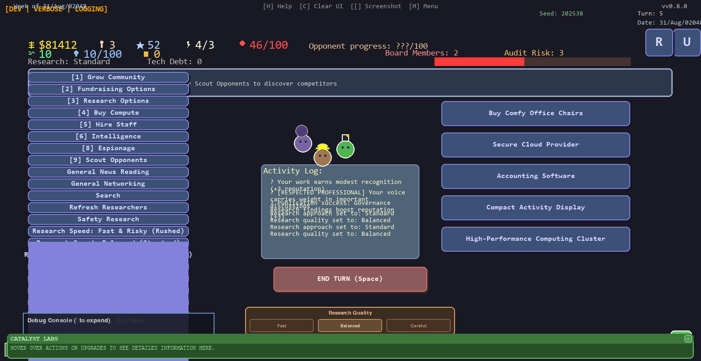
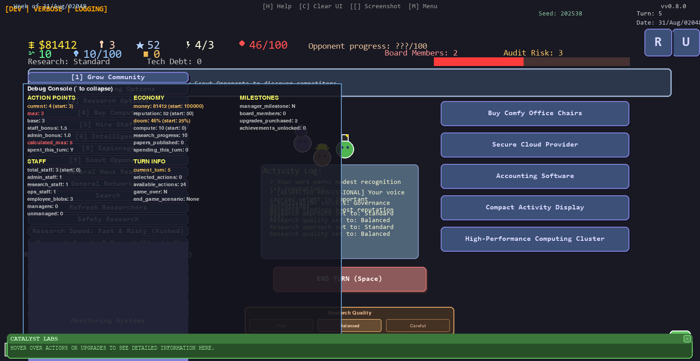

# P(Doom): AI Safety Strategy Game
**v0.8.0 "Modular Architecture" - Major Refactoring & Quality Update**



**Unregulated AI poses an existential threat to humanity.**
 
In this satirical strategy game, you manage a bootstrap AI safety lab racing against well-funded opponents to solve the alignment problem before everyone dies. Experience the challenge of running a scrappy nonprofit in the competitive AI safety space.

## TROPHY Latest Achievement: Major Architecture Overhaul

**Version 0.8.0 "Modular Architecture"** represents a massive refactoring success:
- **558 lines extracted** from monolithic code (111.6% of 500-line goal exceeded!)
- **6 focused modules created** with clean separation of concerns
- **10.9% reduction** in core monolith size (6,240 -> 5,682 lines)
- **Zero functional regressions** - all game systems preserved and enhanced

### New Modular Architecture
```
src/core/
? game_constants.py      # Core defaults and configuration
? ui_utils.py           # UI positioning and collision detection  
? verbose_logging.py    # RPG-style message formatting
? employee_management.py # Employee lifecycle management
? dialog_systems.py     # Dialog state and option management
? utility_functions.py  # Validation and processing utilities
```

### Key Features
- **[WRENCH] Clean Architecture**: Systematic modular design for maintainability
- **[SHIELD] Enhanced Stability**: Comprehensive type annotations and testing
- **[CLOCK] Strategic Gameplay**: 12-13 turn games with meaningful decision depth
- **[DOLLAR] Bootstrap Economics**: $100k starting funds with realistic costs
- **[TROPHY] Competitive Leaderboards**: Seed-specific competition tracking
- **[SPEAKER] Audio Experience**: Professional sound effects for demonstrations

## GAME Core Features

- **Privacy-First Design** - Your data stays under your control  
- **Deterministic Gameplay** - Reproducible games for competitive verification  
- **Optional Analytics** - Detailed logging for strategy improvement (opt-in only)  
- **Pseudonymous Competition** - Compete without compromising privacy  



## LAUNCH Quick Start

### Option 1: Windows Executable (Recommended)

**For Windows 10/11 users who want the simplest experience:**

1. **Download** the single executable from [Releases](https://github.com/PipFoweraker/pdoom1/releases)
2. **Run** by double-clicking (Windows Defender may show a warning - click "More info" -> "Run anyway")
3. **Play** immediately - no Python installation or setup required!

See [docs/technical/DISTRIBUTION.md](docs/technical/DISTRIBUTION.md) for detailed distribution instructions.

### Option 2: Python Installation (Advanced Users)

**Prerequisites:**
- Python 3.9+ (Python 3.12+ recommended)
- Git (optional, for cloning)

**Quick Install:**
```bash
# Clone the repository
git clone https://github.com/PipFoweraker/pdoom1.git
cd pdoom1

# Install dependencies
pip install -r requirements.txt

# Run the game
python main.py
```

**Alternative: Download ZIP**
1. Download the latest release ZIP from GitHub
2. Extract to your desired folder  
3. Open terminal in the pdoom1 folder
4. Run: `pip install -r requirements.txt`
5. Play: `python main.py`

**Privacy Note:** P(Doom) is designed with privacy-first principles. All data stays local by default, and any optional features require explicit opt-in. See [docs/PRIVACY.md](docs/PRIVACY.md) for full details.

## TARGET Game Features

### ? **Modular Architecture (v0.8.0)**
- **Clean Code Organization**: 6 focused modules extracted from monolithic structure
- **Enhanced Maintainability**: 558 lines systematically refactored for clarity
- **Zero Regressions**: All functionality preserved through systematic testing
- **Developer-Friendly**: Comprehensive type annotations and documentation

### GAME **Core Gameplay**
- **Strategic Decision Making**: Balance funding, hiring, and research priorities
- **Realistic Economics**: $100k starting budget with authentic startup costs
- **Competitive AI**: Face 3 opponent labs with unique strategies and capabilities
- **12-13 Turn Games**: Extended gameplay for meaningful strategic depth

### ? **Privacy & Security**
- **Local-First Storage**: All data stays on your device by default
- **Pseudonymous Competition**: Compete without revealing personal information
- **Deterministic Gameplay**: Same seed = same outcomes for fair verification
- **Granular Privacy Controls**: Choose exactly what data to share and when

### TROPHY **Competition Features**
- **Seed-Specific Leaderboards**: Each game seed has isolated competition
- **Dual Identity Support**: Separate player names and lab names
- **Achievement System**: Track progress across multiple playthroughs
- **Data Export**: JSON export for custom analysis tools (opt-in)

### TOOL **Technical Features**
- **Professional Audio**: Sound effects enabled by default for demonstrations
- **Tutorial System**: Interactive guided walkthrough for new players
- **Debug Tools**: Comprehensive development and troubleshooting utilities
- **Cross-Platform**: Works on Windows, macOS, and Linux

### ? **Alpha Testing Features**
- **Dev Mode**: Press F10 to toggle development overlay with debug information
- **Verbose Logging**: Comprehensive action tracking and game state analysis
- **Screenshot System**: Press `[` to capture screenshots for bug reports
- **Emergency Recovery**: Ctrl+E for emergency state recovery in case of issues
- **UI Diagnostics**: Ctrl+D for real-time UI debugging information
- **Pseudonymous Only**: Compete with chosen display names, not real identities
- **User-Controlled**: Enable/disable leaderboard participation anytime
- **Local-First**: Scores stored locally with optional cloud sync
## ? How to Play

### Game Overview
You run an AI safety lab competing against 3 opponent organizations to reduce P(Doom) - the probability of AI causing human extinction. Balance your budget, hire researchers, and make strategic decisions across 12-13 turns.

### Core Mechanics
- **Resources**: Money, Staff, Reputation, Action Points, Compute
- **Doom Counter**: Starts at 25%, reduce it to 0% to win
- **Weekly Turns**: Each turn represents strategic decisions for one week
- **Opponent Labs**: Face DeepSafety, Anthropic analog, and a stealth competitor

### UI Layout
- **Left Column**: Repeating actions (Hire, Research, Infrastructure)
- **Right Column**: Strategic decisions (Board meetings, Lobbying, Partnerships) 
- **Middle Column**: Staff visualization and game context
- **Bottom**: Resource counters and turn information

### Controls
- **Mouse**: Click buttons and UI elements
- **Keyboard**: Use hotkeys shown on buttons (1, H, R, etc.)
- **Enter/Space**: End turn and process results
- **`[` key**: Take screenshot for bug reporting
- **F10**: Toggle dev mode (alpha testing)
- **Ctrl+D**: UI diagnostics overlay
- **Ctrl+E**: Emergency recovery mode
- **Ctrl+R**: Reset tutorial hints
- **Escape**: Quit game

### Quick Start Steps
1. Start the game with `python main.py`
2. Use mouse or keyboard shortcuts to select actions
3. Manage your resources: Money, Staff, Action Points, Reputation
4. Research AI Safety while navigating funding challenges
5. Compete with rival labs to reduce P(Doom) to zero!

## TOOLS Troubleshooting

### Common Issues
- **"pygame not found"** -> Run `pip install pygame`
- **"Python not found"** -> Install Python 3.9+ from [python.org](https://python.org)
- **Game won't start** -> Check Python version: `python --version`
- **Missing dependencies** -> Run `pip install -r requirements.txt`
- **Screen too small** -> Game requires 1024x768 minimum resolution
- **Keyboard not working** -> Click on game window to ensure it has focus

### Testing Installation
```bash
# Verify Python and dependencies
python --version  # Should be 3.9+
python -c "import pygame; print('Pygame working!')"
```
- Antivirus blocking? Add folder to exclusions

================
DOCUMENTATION & SUPPORT
================

PLAYER RESOURCES:
- Player Guide (docs/PLAYERGUIDE.md) - How to play, controls, and strategies  
- Configuration Guide (docs/CONFIG_SYSTEM.md) - Customize your experience
- Changelog (CHANGELOG.md) - Version history and new features

DEVELOPER RESOURCES:  
- Developer Guide (docs/DEVELOPERGUIDE.md) - Contributing and code structure
## GAME Game Modes

- **Standard**: Balanced gameplay experience for casual play
- **Deterministic**: Reproducible games using custom seeds for competition
- **Alpha Testing**: Enhanced logging and debug features for development feedback
- **Privacy Mode**: All analytics and logging disabled (default)
- **Community Competition**: Seed-specific leaderboards with pseudonymous play

## SETTINGS Configuration & Testing

**Testing Installation:**
```bash
# Test core functionality
python test_fixes.py

# Run full test suite
python -m pytest -v

# Test specific systems
python -m pytest tests/test_deterministic_rng.py -v
```

**Privacy Controls:**
Access privacy settings in-game via Settings -> Privacy, or review [docs/PRIVACY.md](docs/PRIVACY.md) for complete documentation.

## ? Alpha Testing & Development

**P(Doom) v0.8.0 is in active alpha development.** We welcome feedback, bug reports, and suggestions!

### Development Mode Features
- **F10 Toggle**: Activate dev mode for detailed game state information
- **Verbose Logging**: Enable comprehensive action tracking (Settings -> Logging)
- **Debug Overlay**: Ctrl+D shows UI element boundaries and collision detection
- **Emergency Recovery**: Ctrl+E resets game state if issues occur
- **Screenshot Tools**: `[` key captures timestamped screenshots in `screenshots/`

### Feedback & Bug Reporting
- **Screenshots**: Use `[` key to capture visual bugs or interesting moments
- **Log Files**: Located in `logs/` directory with detailed session information  
- **GitHub Issues**: [Report bugs](https://github.com/PipFoweraker/pdoom1/issues) with screenshots and log excerpts
- **Verbose Mode**: Enable in Settings -> Logging for detailed troubleshooting data

### Alpha Testing Checklist
- [ ] Test different game seeds for reproducibility issues
- [ ] Try various screen resolutions and UI scaling
- [ ] Report any keyboard/mouse interaction problems
- [ ] Test save/load functionality and settings persistence
- [ ] Verify privacy controls work as expected

## ? Privacy & Data Protection

P(Doom) is built with **privacy-first design principles**:

### Your Data Stays Yours
- All game data stored locally by default
- No personal information required to play
- No data transmission without explicit opt-in
- Deterministic mode for fair competition without data sharing
- Pseudonymous leaderboards with user-chosen display names

### Transparent Practices
- **Open Source**: All privacy code is auditable
- **Clear Controls**: Granular privacy settings in-game
- **User Ownership**: Export, modify, or delete your data anytime
- **Full Documentation**: Complete privacy policy at [docs/PRIVACY.md](docs/PRIVACY.md)

## TOOLS Development & Contributing

### Running Tests
```bash
# Quick validation
python test_fixes.py

# Full test suite (500+ tests)
python -m pytest -v

# Test specific systems  
python -m pytest tests/test_deterministic_rng.py tests/test_verbose_logging.py -v
```

### Development Tools
```bash
# Interactive development launcher
python dev.py

# Test specific systems
python tools/dev_tool.py --test leaderboard
python tools/dev_tool.py --list
```

### Documentation
- **Developer Guide**: [docs/DEVELOPERGUIDE.md](docs/DEVELOPERGUIDE.md) - Code structure and contributing
- **Player Guide**: [docs/PLAYERGUIDE.md](docs/PLAYERGUIDE.md) - Complete gameplay reference  
- **Privacy Policy**: [docs/PRIVACY.md](docs/PRIVACY.md) - Complete privacy documentation
- **Documentation Index**: [docs/DOCUMENTATION_INDEX.md](docs/DOCUMENTATION_INDEX.md) - Complete navigation guide
- **Organized Structure**: Clean [docs/](docs/) directory with categorized subdirectories (recently reorganized Sept 2025)

## LIST Project Status

**Current Version**: v0.8.0 "Modular Architecture" (Alpha)  
**Status**: Major refactoring complete with enhanced stability  
**Alpha Focus**: Clean modular design with comprehensive type safety and debugging tools  
**Testing Phase**: Active development with community feedback integration  
**Next Milestone**: Beta release with enhanced gameplay features and distribution improvements

### Alpha Development Priorities
- [ ] UI/UX polish and accessibility improvements
- [ ] Extended gameplay content and balance refinements
- [ ] Cross-platform distribution testing
- [ ] Community feedback integration
- [ ] Performance optimization and stability testing

## ? License & Attribution

**Educational & Satirical Use Only** - Not affiliated with any AI organization

**Created by**: [@PipFoweraker](https://github.com/PipFoweraker)  
**Report Issues**: [GitHub Issues](https://github.com/PipFoweraker/pdoom1/issues)  
**Discussions**: [GitHub Discussions](https://github.com/PipFoweraker/pdoom1/discussions)
