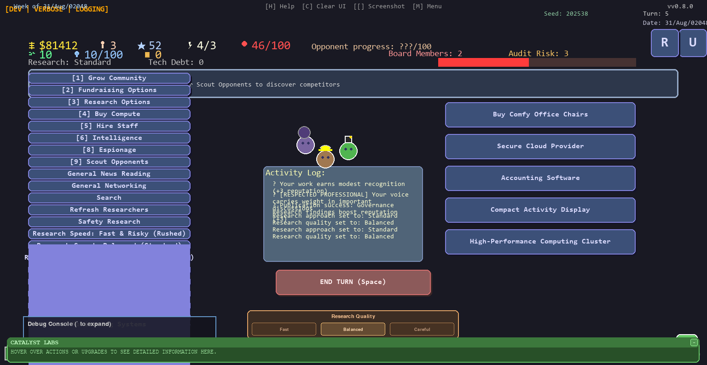

# P(Doom): AI Safety Strategy Game

**Manage an AI safety lab racing to solve alignment before it's too late.**

## Download & Play

**Latest version: v0.11.0** - Choose your platform:

- 🪟 **[Windows](https://github.com/PipFoweraker/pdoom1/releases/download/v0.11.0/PDoom.exe)** - Download and run
- 🐧 **[Linux](https://github.com/PipFoweraker/pdoom1/releases/download/v0.11.0/PDoom.x86_64)** - Download, `chmod +x`, and run
- 🍎 **[macOS](https://github.com/PipFoweraker/pdoom1/releases/download/v0.11.0/PDoom.app.zip)** - Download, unzip, and run

**No installation required** - just download and play!

## About the Game

You run an underfunded AI safety lab racing against well-resourced competitors to solve the alignment problem. Make strategic decisions about hiring, research priorities, and resource allocation. Your choices determine whether P(Doom) reaches 0% or humanity faces extinction.

**Gameplay:**
- Hire individual researchers from a candidate pool (Safety, Capabilities, Interpretability, Alignment)
- Manage teams of up to 8 researchers per manager
- Balance researcher traits (team_player, media_savvy, leak_prone) for optimal productivity
- Handle burnout, poaching events, and doom from reckless research
- Respond to rival lab actions and random events
- Survive 100 turns with P(Doom) at 0%

## Need Help?

- BOOK **[How to Play](docs/PLAYERGUIDE.md)** - Game mechanics and strategy
- HELP **[Discussions](https://github.com/PipFoweraker/pdoom1/discussions)** - Questions and community
- GLOBAL **[Website](https://pdoom1.com)** - Guides, community, and updates
- MAP **[Roadmap](docs/ROADMAP.md)** - Where the game is headed (milestones + quarterly pins)
- 🐛 **Report a Bug** - Press **`\`** (the backslash key) or **`N`** in-game, or [open an issue](https://github.com/PipFoweraker/pdoom1/issues)

## Community & Contributing

Found a bug? Have a suggestion? Press **`\`** (the backslash key) or **`N`** in-game to open the bug reporter, or visit our [GitHub Issues](https://github.com/PipFoweraker/pdoom1/issues).

### Contributor Recognition Program 🐱

We immortalize our contributors in the game! Report bugs, suggest features, or help with playtesting, and your cat can become an **Office Cat** in P(Doom).

- **See your cat in the game** with 5 doom-level variants
- **Get listed in the credits** with your contributions
- **Help shape the game** and make it better for everyone

Learn more: **[Contributor Rewards Program](docs/CONTRIBUTOR_REWARDS.md)**

## For Developers

Want to contribute or build from source?

- **[Contributing](CONTRIBUTING.md)** - Get started
- **[Architecture](docs/developer/ARCHITECTURE.md)** - Codebase overview
- **[Full Changelog](CHANGELOG.md)** - Version history

**Built with Godot 4.5.1** | **Open Source (MIT License)**

---

**Made with coffee and existential dread** ☕ | [Contributors](docs/CONTRIBUTORS.md)
