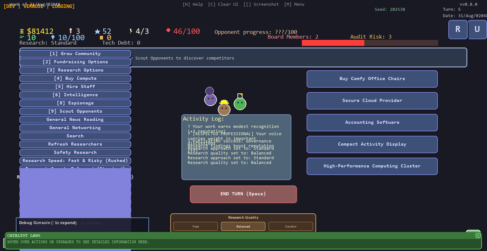

# P(Doom): AI Safety Strategy Game

**Run an underfunded AI safety lab and hold off catastrophe for as long as you can.**

## Download & Play

Grab the **[latest release](https://github.com/PipFoweraker/pdoom1/releases/latest)** --
Windows, macOS and Linux builds are all published. No installer for any of them.

| Platform | File on the release page | Status |
|---|---|---|
| Windows | `PDoom-Windows-<version>.zip` | Tested |
| macOS | `PDoom-macOS-<version>.zip` | Ships, boot-test not yet confirmed by us |
| Linux | `PDoom-Linux-<version>.zip` | Ships, boot-test not yet confirmed by us |

**Extract the zip before running it.** Launching the executable from inside the
zip viewer will fail in confusing ways on every platform.

### Running it -- first-launch friction, by platform

The builds are **not code-signed yet** ([#917](https://github.com/PipFoweraker/pdoom1/issues/917)),
so each OS will warn you that the developer is unidentified. This is expected,
and here is how to get past it.

**Windows.** SmartScreen shows "Windows protected your PC". Click **More info**,
then **Run anyway**.

**macOS.** Double-clicking gives "cannot be opened because it is from an
unidentified developer". On macOS Sequoia (15.x) Apple **removed** the old
right-click-then-Open workaround, so that route now offers only Cancel and Move
to Trash. Instead:

1. Try to open the app once and dismiss the warning.
2. Open **System Settings -> Privacy & Security**, scroll to **Security**.
3. Click **Open Anyway** next to the P(Doom) entry, then confirm.

Or, from Terminal: `xattr -dr com.apple.quarantine /path/to/PDoom.app`

*(We do not develop on macOS and have limited test coverage there. If these
steps do not work for you, please
[open an issue](https://github.com/PipFoweraker/pdoom1/issues) -- that is
genuinely useful to us.)*

**Linux.** Mark the binary executable before running it:
`chmod +x PDoom.x86_64`

### Or run from source

Any platform, with Godot 4.5.1 -- see [For Developers](#for-developers).

## About the Game

You run an underfunded AI safety lab while better-resourced competitors race toward AGI. There is no win screen -- alignment is not a thing you finish. What you can do is buy time. Make strategic decisions about hiring, research priorities, and resource allocation, and hold the line for as many turns as you can before doom or the competition ends the run. Your score is the number of turns survived.

**Gameplay:**
- Hire individual researchers from a candidate pool (Safety, Capabilities, Interpretability, Alignment)
- Manage teams of up to 8 researchers per manager
- Balance researcher traits (team_player, media_savvy, leak_prone) for optimal productivity
- Handle burnout, poaching events, and doom from reckless research
- Respond to rival lab actions and random events
- Buy time against rising P(Doom): there is no victory condition, only how long you last
- Every run ends in defeat; the score is turns survived, and the end screen attributes honestly what killed you
- Deterministic seeds -- a given seed plays identically for everyone, so scores are comparable

## Need Help?

- BOOK **[How to Play](docs/PLAYERGUIDE.md)** - Game mechanics and strategy
- HELP **[Discussions](https://github.com/PipFoweraker/pdoom1/discussions)** - Questions and community
- GLOBAL **[Website](https://pdoom1.com)** - Guides, community, and updates
- MAP **[Roadmap](docs/ROADMAP.md)** - Where the game is headed (milestones + monthly Themes)
- **Report a Bug** -- Press **`N`** in-game (or use the on-screen Report Bug button), or [open an issue](https://github.com/PipFoweraker/pdoom1/issues)

## Community & Contributing

Found a bug? Have a suggestion? Press **`N`** in-game to open the bug reporter, or visit our [GitHub Issues](https://github.com/PipFoweraker/pdoom1/issues).

### Contributor Recognition Program

We immortalize our contributors in the game! Report bugs, suggest features, or help with playtesting, and your cat can become an **Office Cat** in P(Doom).

- **See your cat in the game** with 5 doom-level variants
- **Get listed in the credits** with your contributions
- **Help shape the game** and make it better for everyone

Learn more: **[Contributor Rewards Program](docs/CONTRIBUTOR_REWARDS.md)**

## For Developers

Want to contribute or build from source?

- **[Contributing](CONTRIBUTING.md)** - Get started
- **[Architecture](docs/ARCHITECTURE.md)** - Codebase overview
- **[Full Changelog](CHANGELOG.md)** - Version history

**Built with Godot 4.5.1** | **Source-available -- see [LICENSE](LICENSE)**

---

**Made with coffee and existential dread**  | [Contributor Rewards](docs/CONTRIBUTOR_REWARDS.md)
