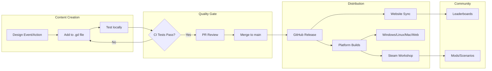

# P(Doom) Architecture & Expansion Promise

**For Funders & Partners** | Reading Time: 5-8 minutes

---

## What Is P(Doom)?

P(Doom) is a strategy game where players manage an underfunded AI safety lab racing to prevent artificial general intelligence from causing human extinction. Players hire researchers, allocate resources, and navigate a complex web of rival labs, media attention, and real-world AI safety events.

**Current Status**: v0.11.0 (public alpha) | Windows, Linux, macOS, Web | Godot 4.5 engine

---

## 1. What Exists Today

### Core Game (Production-Ready)

| Component | Status | Description |
|-----------|--------|-------------|
| **Game Engine** | Complete | 14 core systems, ~6,000 lines GDScript |
| **UI System** | Complete | Responsive layouts, keyboard navigation, accessibility |
| **Turn System** | Complete | Deterministic RNG for replays and competitive fairness |
| **Doom Mechanics** | Complete | Layered calculation with momentum, source tracking |
| **Staff Management** | Complete | Hiring, traits, specializations, burnout |
| **Event System** | Complete | Random events, player choices, consequences |
| **Conference/Travel** | Complete | 9 conferences, paper submissions, jet lag |

### Infrastructure (Production-Ready)

| Component | Status | Description |
|-----------|--------|-------------|
| **CI/CD Pipeline** | 12 workflows | Automated testing, releases, deployment |
| **Test Suite** | 30+ tests | Unit tests, integration tests, GUT framework |
| **Documentation** | 50+ files | Player guide, developer guide, architecture docs |
| **Export Targets** | 4 platforms | Windows, Linux, macOS, Web |
| **Steam Integration** | Prepared | GodotSteam addon integrated, Phase 1 complete |

### Website & Data Pipeline

```
pdoom1 (game repo)          pdoom1-website              pdoom-data
       |                          |                          |
       |---> _website_export/ --->|                          |
       |                          |                          |
       |<-------- shared/schemas/ -----------------------<---|
       |                                                     |
       |<--- Historical timeline events, organization data --|
```

---

## 2. Modularity Points

The architecture is designed for rapid content expansion without engine changes.

### Content Layer (No Code Required)

```
┌─────────────────────────────────────────────────────────────┐
│                    DATA-DRIVEN CONTENT                       │
├─────────────────────────────────────────────────────────────┤
│  events.gd        → Add events by editing dictionary array   │
│  actions.gd       → Add actions by editing dictionary array  │
│  upgrades.gd      → Add upgrades by editing dictionary array │
│  researcher.gd    → Add traits/specializations to dicts      │
│  rivals.gd        → Add rival labs to array                  │
│  conferences.gd   → Add conferences to array                 │
├─────────────────────────────────────────────────────────────┤
│  configs/*.json   → Game presets (difficulty, balance)       │
│  data/*.json      → Historical timeline, icon mappings       │
│  shared/schemas/  → JSON validation for mod content          │
└─────────────────────────────────────────────────────────────┘
```

**Example**: Adding a new event requires editing ONE file:

```gdscript
# In events.gd - just add to the array:
{
    "id": "congressional_hearing",
    "name": "Congressional AI Hearing",
    "type": "popup",
    "trigger_type": "random",
    "probability": 0.08,
    "options": [
        {"id": "testify", "text": "Send researcher to testify", ...},
        {"id": "decline", "text": "Decline invitation", ...}
    ]
}
```

### Systems Layer (Small Code Changes)

| Extension Point | Complexity | Example |
|-----------------|------------|---------|
| New event triggers | ~20 lines | "Trigger when doom > 80" |
| New doom sources | ~10 lines | "Add tech debt to doom" |
| New UI screens | Copy template | Achievement screen |
| New autoload systems | ~100 lines | Notification manager |

### Engine Layer (Major Development)

| Extension | Scope | Use Case |
|-----------|-------|----------|
| Alliance system | New mechanic | Multi-lab cooperation |
| Legislative system | New mechanic | Policy/governance tracking |
| Save/load | Core feature | Persistence |
| Multiplayer | Architecture | Competitive play |

---

## 3. How New Content Ships



### Content Pipeline Stages

**Stage 1: Creation** (1-4 hours per content piece)
- Designer writes event/action data
- Artist creates icon if needed (31 icon categories organized)
- Writer drafts text content

**Stage 2: Integration** (~15 minutes)
- Edit appropriate .gd file (events, actions, upgrades, etc.)
- Run local tests
- Create PR

**Stage 3: Release** (automated)
- CI validates all content
- Builds generated for all platforms
- Website updated automatically
- Leaderboard data synced

### Planned: Scenario Packs

Future content expansions as downloadable scenario packs:

| Pack | Theme | Content |
|------|-------|---------|
| **2017-2020 Timeline** | Historical | 40+ real events from AI safety history |
| **Regulatory Crisis** | Governance | EU AI Act, state bills, compliance events |
| **Capabilities Race** | Competition | GPT releases, frontier labs, talent wars |
| **Community Expansion** | Characters | Real researchers as hireable characters |

Each pack: ~20 events, ~5 actions, ~3 upgrades, custom config

---

## 4. Bottlenecks & What Funding Buys

### Current Bottlenecks

```
┌────────────────────────────────────────────────────────────────┐
│                     DEVELOPMENT CAPACITY                        │
├───────────────┬─────────────────────┬──────────────────────────┤
│   Bottleneck  │   Current State     │   With Funding           │
├───────────────┼─────────────────────┼──────────────────────────┤
│ Dev Throughput│ 1 part-time dev     │ 2-3 full-time devs       │
│               │ ~10 hrs/week        │ 80+ hrs/week             │
├───────────────┼─────────────────────┼──────────────────────────┤
│ Art Pipeline  │ Stock + generated   │ Commissioned pixel art   │
│               │ icons               │ Character portraits      │
├───────────────┼─────────────────────┼──────────────────────────┤
│ Content Design│ Solo designer       │ Researcher collaboration │
│               │                     │ Playtester feedback loop │
├───────────────┼─────────────────────┼──────────────────────────┤
│ QA/Testing    │ Manual spot checks  │ Automated regression     │
│               │                     │ Community beta program   │
├───────────────┼─────────────────────┼──────────────────────────┤
│ Release Eng   │ Manual releases     │ Continuous deployment    │
│               │ ~monthly            │ Weekly patches           │
└───────────────┴─────────────────────┴──────────────────────────┘
```

### Funding Tiers & Deliverables

**Tier 1: Sustainability ($25K/year)**
- Maintain current release cadence
- Bug fixes and stability
- Community support

**Tier 2: Growth ($75K/year)**
- Full-time lead developer
- Monthly content updates (5-10 events/month)
- Steam release with achievements
- Localization (3-5 languages)

**Tier 3: Scale ($150K/year)**
- 2-3 person dev team
- Weekly content updates
- Commissioned art assets
- Educational partnerships
- Multi-platform expansion (mobile)

**Tier 4: Impact ($300K+/year)**
- Dedicated content team
- Research collaboration (AI safety orgs)
- Conference/workshop presence
- Curriculum integration
- Community mod support (Steam Workshop)

### Return on Investment

| Investment | Timeline | Deliverable |
|------------|----------|-------------|
| $5K | 2 weeks | Complete scenario pack (20 events) |
| $10K | 1 month | New game mechanic (alliance system) |
| $25K | 2 months | Steam release + achievements |
| $50K | 3 months | Mobile port (iOS/Android) |
| $100K | 6 months | Full educational package |

---

## 5. Technical Scalability

### Why Godot + GDScript?

- **Cross-platform**: One codebase, all platforms
- **Lightweight**: 50MB game size, runs on modest hardware
- **Open-source**: No licensing fees, community-supported
- **Web export**: Instant browser play, no install barrier
- **Steam-ready**: GodotSteam integration complete

### Architecture Strengths

1. **Deterministic RNG**: Every game can be replayed identically from seed
2. **Signal-based UI**: UI completely decoupled from game logic
3. **Data-driven content**: No recompilation for content changes
4. **Schema validation**: Automated content validation in CI
5. **Modular autoloads**: Systems can be upgraded independently

### Growth Path

```
Current:        Single-player, 4 platforms, ~50 events
↓
Near-term:      Steam Workshop mods, 100+ events, localization
↓
Medium-term:    Leaderboard competitions, educational licenses
↓
Long-term:      Multiplayer, procedural content, AI-generated events
```

---

## 6. Why This Can Scale

### The Content Multiplication Model

Each new event, action, or mechanic creates combinatorial gameplay:

```
50 events × 10 actions × 20 traits × 5 difficulties = 50,000 unique game states
```

Adding 10 events doesn't add 10 experiences - it multiplies the possibility space.

### The Distribution Advantage

- Web export = zero-friction onboarding
- Steam = discoverability + community
- Educational licenses = institutional adoption
- Open content schemas = community contributions

### The Mission Alignment

P(Doom) isn't just a game - it's an educational tool for AI safety concepts:
- **Players learn** doom calculations, alignment challenges, coordination problems
- **Researchers can** embed real scenarios, test communication strategies
- **Educators can** use scenario packs for courses and workshops

---

## Summary

| Aspect | Current | With Funding |
|--------|---------|--------------|
| Release cadence | Monthly | Weekly |
| Content updates | 5 events/month | 20+ events/month |
| Platforms | 4 (Win/Lin/Mac/Web) | 6+ (add mobile, Steam Workshop) |
| Languages | English | 5+ languages |
| Team | 1 part-time | 2-3 full-time |
| Reach | Hundreds | Tens of thousands |

**The architecture is ready**. The bottleneck is development capacity.

---

*Document version: 1.0.0 | Last updated: 2025-12-13*
*Link from: https://pdoom.org/donors/architecture*
