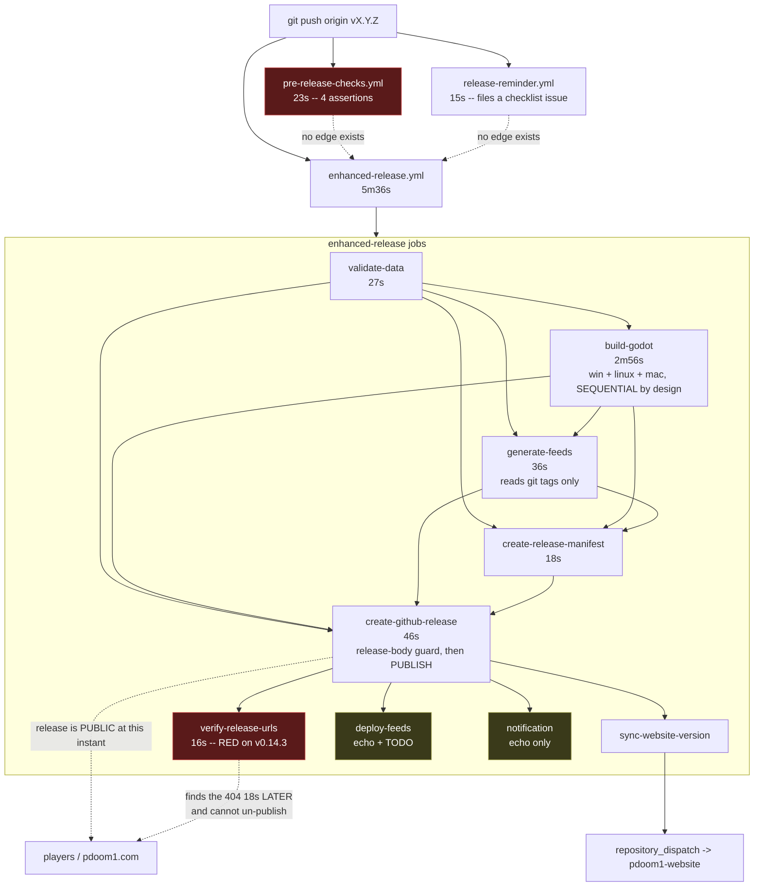
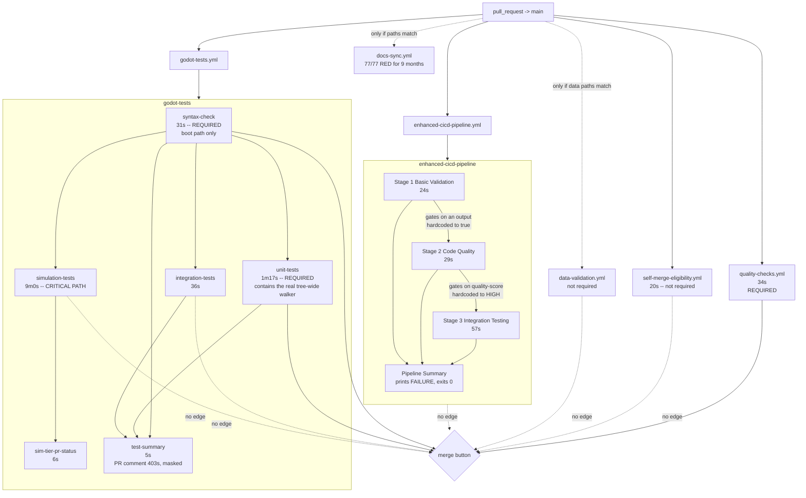
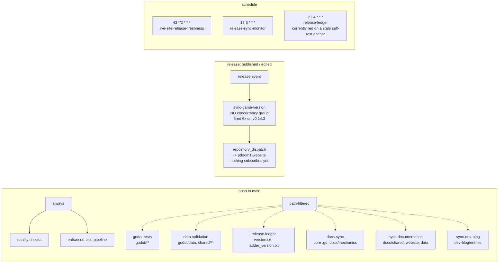

# Release and CI flow map -- 2026-08-24

What fires on what, in what order, with what dependencies, across the five
trigger surfaces this repo has: **push to main**, **pull_request**, **tag push**,
**release published/edited**, and **schedule**.

Companion to `docs/deployment/GATE_AUDIT_2026-08-24.md`, which judges whether
each gate works. This document is about the SHAPE: what is genuinely parallel,
what merely looks parallel and is racing, and what is sequential by accident
rather than design.

The diagram carries the shape. The table carries the provenance, because a
diagram cannot cite a command.

Read at `161240be`. Timings are from the v0.14.3 tag (run `32690368004`) and
PR #1303 (run `32690282031`), both real, both measured.

---

## 1. The five surfaces at a glance

| surface | workflows started | coordination between them |
|---|---|---|
| push to `main` | 2 always + up to 6 more on path filters | **none** |
| `pull_request` -> `main` | 4 (5 if `docs-sync` paths match) | **none**; 3 of 13 resulting checks are required |
| tag push `v*.*.*` | **3** | **none** |
| `release: published` / `edited` | 1 | no `concurrency:` group |
| `schedule` | 3, on three different crons | independent by design, correctly |

```bash
python - <<'PY'
import pathlib, re
for f in sorted(pathlib.Path('.github/workflows').glob('*.yml')):
    t = f.read_text(encoding='utf-8')
    ev = [e for e in ('push:','pull_request:','release:','schedule:','workflow_dispatch','workflow_call')
          if re.search(r'^  ' + re.escape(e), t, re.M)]
    print(f"{f.name:36} {' '.join(ev)}")
PY
```

---

## 2. Tag push -- the surface Pip asked about

### 2.1 The shape



The two dotted "no edge exists" arrows are the whole finding. `pre-release-checks`
and `release-reminder` and `enhanced-release` are three verdicts about the same
tag, started by the same event, joined by nothing.

### 2.2 The table, with provenance

| # | thing | trigger | depends on | duration | conclusion on v0.14.3 | command |
|---|---|---|---|---|---|---|
| 1 | `pre-release-checks.yml` | `push: tags: v*.*.*` | nothing | 23s | success (2nd attempt), failure (1st) | `gh api ".../workflows/pre-release-checks.yml/runs?per_page=5"` |
| 2 | `release-reminder.yml` | `push: tags: v*.*.*` | nothing | 15s | success, both attempts | same, for `release-reminder.yml` |
| 3 | `enhanced-release.yml` | `push: tags: v*.*.*` | nothing | 5m36s | **failure**, both attempts | `gh api ".../workflows/enhanced-release.yml/runs?per_page=5"` |
| 3a | `validate-data` | -- | -- | 27s | success | `gh api ".../actions/runs/32690368004/jobs"` |
| 3b | `build-godot` | -- | `validate-data` **via an output**, not `needs` alone | 2m56s | success | same |
| 3c | `generate-feeds` | -- | `[validate-data, build-godot]` | 36s | success | same |
| 3d | `create-release-manifest` | -- | `[validate-data, build-godot, generate-feeds]` | 18s | success | same |
| 3e | `create-github-release` | -- | `[validate-data, build-godot, generate-feeds, create-release-manifest]` | 46s | success -- **published 04:37:16** | same |
| 3f | `verify-release-urls` | -- | `create-github-release` | 16s | **failure 04:37:34** | same |
| 3g | `sync-website-version` | -- | `create-github-release` | 17s | success | same |
| 3h | `deploy-feeds` | -- | `create-github-release` | 11s | success (`echo` + `ls`) | `sed -n '/deploy-feeds/,/notification/p' .github/workflows/enhanced-release.yml` |
| 3i | `notification` | -- | `create-github-release`, `if: always()` | 2s | success (`echo`) | same |

**The 18 seconds.** `Create GitHub Release` completed at `04:37:16`;
`Verify Release Download URLs` started at `04:37:18` and failed at `04:37:34`
with `[!] v0.14.3.mac 404 (Not Found)`. The release is still up.

```bash
gh api "repos/PipFoweraker/pdoom1/actions/runs/32690368004/jobs" \
  --jq '.jobs[] | [.name,.conclusion,.started_at,.completed_at] | @tsv'
gh api "repos/PipFoweraker/pdoom1/actions/jobs/97323684446/logs" | grep -E '404|\[OK\]'
```

### 2.3 The measured cost of having no edge

The FIRST v0.14.3 tag push, at 04:11:26, is the clean experiment. All three
workflows started from the same event.

| time | what happened |
|---|---|
| 04:11:45 | `release-reminder` files GitHub issue "Release Checklist: v0.14.3" -- for a release that will not happen |
| 04:11:47 | `pre-release-checks` detects `RN003: CHANGELOG section [0.14.3] cites #1225 but that issue is OPEN`, 7 fatal |
| 04:11:47 | its issue-filing step 403s. **The finding reaches nobody.** |
| 04:11:55 | `enhanced-release` starts `build-godot`, which knows nothing about any of this |
| 04:14:29 | three platforms built, 2m34s spent |
| 04:16:05 | `enhanced-release` detects **the same RN003**, at its own release-body guard, and correctly skips `Create Release` |

```bash
gh api "repos/PipFoweraker/pdoom1/actions/runs/32689075022/jobs" --jq '.jobs[].steps[] | "\(.name) = \(.conclusion)"'
gh api "repos/PipFoweraker/pdoom1/actions/jobs/97319351960/logs" | grep -E "RN003|not accessible"
gh api "repos/PipFoweraker/pdoom1/actions/runs/32689075164/jobs" --jq '.jobs[] | [.name,.conclusion,.started_at,.completed_at] | @tsv'
```

**The same defect was caught twice, 4 minutes 18 seconds apart, by two workflows
that cannot see each other.** The cheap catch was 21 seconds in and bought
nothing: it did not stop the build, it did not stop the publish attempt, and it
could not file its issue. The expensive catch, after a full three-platform build,
is the one that actually protected the release.

That is the argument in one measurement. It is not "the workflows are untidy" --
it is that the fast gate is strictly dominated while nothing waits for it.

---

## 3. pull_request

### 3.1 The shape



### 3.2 The table

| check context | workflow / job | duration | required? | acts on what |
|---|---|---|---|---|
| `GDScript Syntax Check` | godot-tests / syntax-check | 31s | **YES** | merge button; gates 3 sibling jobs |
| `Unit Tests` | godot-tests / unit-tests | 1m17s | **YES** | merge button |
| `quality-checks` | quality-checks / quality-checks | 34s | **YES** | merge button |
| `Integration Tests` | godot-tests / integration-tests | 36s | no | `test-summary` only |
| `Simulation Tests (slow, non-blocking, SIM-TIER)` | godot-tests | 9m0s | no | a PR comment |
| `Sim Tier PR Status` | godot-tests | 6s | no | a PR comment |
| `Test Summary` | godot-tests | 5s | no | nothing |
| `Self-merge class eligibility` | self-merge-eligibility | 20s | no | **nothing** |
| `Stage 1: Basic Validation` | enhanced-cicd | 24s | no | Stage 2 |
| `Stage 2: Code Quality` | enhanced-cicd | 29s | no | Stage 3 |
| `Stage 3: Integration Testing (3.11)` | enhanced-cicd | 57s | no | Pipeline Summary |
| `Pipeline Summary` | enhanced-cicd | 3s | no | nothing |
| `Quality Dashboard Update` | enhanced-cicd | skipped on PRs | no | nothing |

```bash
gh pr checks 1303
gh api repos/PipFoweraker/pdoom1/branches/main/protection --jq '.required_status_checks.contexts, .enforce_admins.enabled'
# ["GDScript Syntax Check","Unit Tests","quality-checks"]
# false
```

`enforce_admins: false` means the admin-merge path CLAUDE.md documents for agent
PRs walks past even the three required ones. So the honest count of checks that
mechanically stop a merge on the path this repo actually uses is **zero**; the
three required contexts stop the ordinary merge button only.

`Self-merge class eligibility` deserves its own line. It is the mechanism that
makes `class:guard` / `class:docs` mean something -- the workflow's own header
says the labels "promised eligibility and checked nothing" until it existed. It
is well built (self-test plus hermetic suite, both blocking, before the real
check). And it is not a required context, so a PR that fails it can still be
merged by the same button. The label now has a mechanism that reports and does
not enforce.

---

## 4. push to main, release, schedule



| surface | fact | command |
|---|---|---|
| push to main | a CHANGELOG-only merge fires exactly 2 workflows | `gh api ".../actions/runs?event=push&branch=main&per_page=60" --jq '.workflow_runs[] \| [.head_sha[0:8],.name,.conclusion] \| @tsv'` |
| push to main | a `godot/**` merge fires 3-4 | same |
| release | 6 `sync-game-version` runs on v0.14.3, four within 2 seconds | `gh api ".../actions/runs?per_page=100" --jq '.workflow_runs[] \| select(.head_branch=="v0.14.3") \| [.name,.event,.run_started_at] \| @tsv'` |
| release | only 2 workflows in the estate declare `concurrency:` | `grep -l '^concurrency:' .github/workflows/*.yml` |
| schedule | `release-ledger` fails at step 4 of 7, so its actual check never runs | `gh api ".../actions/jobs/97323554003/logs" \| grep SELF-TEST` |
| schedule | `release-sync-monitor` really does compare, with real values | `gh api ".../actions/jobs/97342474757/logs" \| grep -E "Latest published\|IN SYNC"` |

The three crons are the one place in this estate where independence is
**correct**. They answer three different questions -- is the website repo
current, is the live site serving it, was a version bumped and never tagged --
and `release-ledger`'s header explains at length why it must fire on the BUMP
rather than the tag, because everything else in the release family is downstream
of tagging and structurally blind to that state. That reasoning is sound. The
implementation is currently disarmed (section 6.4), but the topology is right.

---

## 5. Parallel, racing, and accidentally sequential

Three categories, because collapsing them is how this got confusing.

### 5.1 Genuinely parallel, and correctly so

| what | why it is fine |
|---|---|
| `unit-tests` / `integration-tests` / `simulation-tests` fanning out from `syntax-check` | Three independent Godot invocations, no shared state, no shared workspace. Textbook fan-out. |
| the three scheduled monitors | Three different questions against three different sources. |
| `quality-checks` / `godot-tests` / `enhanced-cicd` on a PR | No shared state. They duplicate assertions (version consistency appears in all three) but they do not interfere. |
| `verify-release-urls` / `sync-website-version` / `deploy-feeds` / `notification` fanning out from `create-github-release` | Correct fan-out -- all four read the published release and write to different places. |

### 5.2 Looks parallel, is racing

| what | what it is racing | evidence |
|---|---|---|
| the three tag-push workflows | racing to a VERDICT about the same tag, with no join. Whichever finishes first is what a human sees. | section 2.3 |
| `release-reminder` vs the release existing | It files a checklist issue at t+15s for a release that may fail at t+4m39s. It did exactly that on 04:11. | `gh api ".../actions/runs?per_page=100" --jq '.workflow_runs[] \| select(.head_branch=="v0.14.3")'` |
| `verify-release-urls` vs the outside world | The release is downloadable 18 seconds before the check finishes, and permanently after it fails. The race is with a human clicking the link. | section 2.2 |
| `sync-game-version` against itself | Four runs within 2 seconds, no `concurrency:`. Harmless today (one idempotent dispatch). The workflow's own comment records the hazard: once pdoom1-website#289 lands, a dispatch arriving mid-asset-upload publishes a version whose `platforms` come from an incomplete asset list. Four racing dispatches makes that four chances instead of one. | section 4 table |
| `docs-sync` auto-commit vs anything else pushing to main | Would race if it ever ran; it never has, because `has_changes` has always been false and the token is read-only anyway. | `docs/deployment/GATE_AUDIT_2026-08-24.md` F5 |

### 5.3 Sequential by accident, not design

| edge | why it exists | what it costs | what it buys |
|---|---|---|---|
| `unit-tests needs: syntax-check` | historical | 31s on every green run | a faster fail on the boot-path-only subset. But `run_godot_tests.py` runs a STRICTLY STRONGER tree-wide compile-all walker inside `unit-tests` itself. The weak check gates the job containing the strong one. |
| `simulation-tests needs: syntax-check` | copied from the above | 31s in front of the 9-minute critical path | the same weak subset |
| `generate-feeds needs: build-godot` | assumed | ~36s of the release critical path | **nothing measurable.** `generate_release_metadata.py` reads git tags via `subprocess` and never touches `builds/` or any artifact -- there is no `download-artifact` step in that job. Verify: `grep -nE "builds/\|download-artifact" .github/workflows/enhanced-release.yml` and `grep -nE "^def \|subprocess" scripts/generate_release_metadata.py` |
| `create-release-manifest needs: generate-feeds` | assumed | serialises 36s | nothing -- it downloads `build-*` only |
| the three assertions inside `verify-release-urls` | written as three steps of one job | on v0.14.3 the alias check and the rot sweep were **skipped** because the feed check failed first | nothing. They are independent questions about independent things. |
| `pre-release-checks` and `enhanced-release` NOT sequential | nobody wired it | 4m18s of duplicated detection, one wasted red | section 2.3 |

### 5.4 Sequential by design, and correctly so

Stated so the recommendations below do not accidentally break them.

- **The three platform builds inside `build-godot`.** The workflow says why:
  every `build_release.py` run deletes `godot/.godot`, so parallel matrix jobs
  sharing a workspace would corrupt the import caches mid-export. This must stay
  sequential. It is 2m56s of the 5m36s and it is the one place where the obvious
  parallelisation is wrong.
- **The release-body guard between `Extract changelog` and `Create Release`.**
  It must run on the assembled bytes, after assembly and before publication.
  Measured working: it skipped `Create Release` on the 04:11 attempt.
- **`class-cache-check` at post-merge/post-checkout rather than pre-commit.** The
  failure is a property of a long-lived working copy, not of a diff.

---

## 6. Considered view

### 6.1 What should be parallel that is not

1. **`generate-feeds` should not need `build-godot`.** Measured: it reads git
   tags only. Moving it to `needs: [validate-data]` takes the critical path from
   `27s + 2m56s + 36s + 18s + 46s = 5m03s` to about `4m27s`.

   The counter-argument is worth stating because it is nearly right: the feed
   asserts download URLs, so surely it should be derived from what was actually
   built? Yes -- and it is not. It derives URLs from tags, which is precisely how
   #1068 hid (a feed asserting a Linux alias that was never published). So the
   dependency does not buy that property today. **If you want the feed to depend
   on the builds, make it READ the builds; do not leave a `needs:` edge standing
   in for a check it does not perform.** Either change is defensible. Leaving both
   the edge and the absence of the check is the state that misleads.

2. **The three assertions in `verify-release-urls` should not be able to silence
   each other.** They are independent. On v0.14.3 the alias check -- the one added
   because the feed check went green through #1068 -- did not run. Three parallel
   jobs, or one job with `continue-on-error` on each step and an aggregating final
   step, or a single script that collects all three verdicts before exiting. Any
   of those; the property that matters is that a failure of one does not suppress
   the others.

3. **Nothing else.** Resist parallelising the platform builds (5.4) and resist
   parallelising more of the PR surface -- the PR critical path is the 9-minute
   simulation tier, and everything else already finishes inside 1m20s.

### 6.2 What should be sequential that is not

1. **Release verification must precede publication.** This is the structural one.

   The obvious form -- move `verify-release-urls` before `create-github-release`
   -- **does not work**, and it is worth saying why: the asset URLs do not exist
   until the release does. That is not a wiring mistake, it is the actual
   constraint.

   Two forms that do work:

   **(a) Assert on the ARTIFACTS, not on URLs, before publishing.**
   `create-github-release` already runs `download-artifact` with no `name:`, so
   the full expected set is on disk before `action-gh-release` is called. Assert
   the expected filenames are present at that point. This would have caught
   v0.14.3 exactly: `build-mac` was empty because the macOS upload declares
   `if-no-files-found: warn`, and nothing between there and publication looked.
   Cheapest, strongest for the observed failure, needs no GitHub state.

   **(b) Publish as a draft, verify, then flip.** `draft: true`, then check the
   asset list via `gh release view --json assets`, then
   `gh release edit --draft=false`. This generalises to anything about the
   release object rather than the artifacts. Note that a draft's assets are not
   served from the public `/releases/download/` path, so the existing
   alias-URL check cannot simply be moved inside the draft window -- it would
   have to become an asset-NAME check, which is (a) again.

   **Recommendation: (a) as a blocking pre-publication step, keeping the existing
   `verify-release-urls` unchanged afterwards as a post-publication backstop.**
   (a) prevents; the backstop detects things (a) cannot, such as GitHub failing
   to serve an asset that was uploaded.

2. **`release-reminder` should fire after the release exists, not on the tag.**
   Filing a "Release Checklist" issue 15 seconds into a run that fails 4m39s
   later is a notification that beat its own verdict. Move it to
   `on: release: published`, or make it a final job of `enhanced-release`
   gated on `needs.create-github-release.result == 'success'`. Its version
   consistency check is already duplicated in two other places, so nothing is
   lost by moving the whole workflow downstream.

3. **There is a policy contradiction that no wiring change can resolve, and it
   should be settled by a human, not by a workflow.** Issue #1071 rules macOS
   BEST-EFFORT: a macOS export failure warns, drops the macOS assets, and lets
   Windows and Linux publish. The alias check rules that `PDoom.app.zip` MUST
   answer 200. Those two rules contradict, and v0.14.3 is where they collided:
   a deliberate, sanctioned best-effort skip produced a mandatory-check failure
   and a permanent red on a successful release.

   Either the feed and the alias check must become platform-aware (assert only
   the platforms that actually built, and say so in the feed), or macOS stops
   being best-effort. Wiring cannot decide which. Naming it here because the
   current state trains everyone to read a red `verify-release-urls` as "the
   macOS thing again", which is exactly the reflex that will wave through the
   day it is the Windows thing.

### 6.3 Should `pre-release-checks` gate `enhanced-release`, or be merged into it?

The four options, honestly.

**Option A -- leave them independent.** Zero work. Keeps the measured 04:11
outcome: the same defect found twice, 4m18s apart, the cheap find discarded, and
a workflow that is red 16 times out of 20 sitting next to the release that
shipped anyway. The cost is not the wasted compute; it is that a permanently
unreliable red next to every tag is a trained reflex to ignore reds on tags.
**Reject.**

**Option B -- make `enhanced-release` depend on `pre-release-checks` across
workflows.** GitHub has no cross-workflow `needs:` on the same event.
`workflow_run` fires only after the fact and has awkward semantics for tags.
This is achievable only by polling or by an artificial gate job. **Reject on
mechanism, not on intent.**

**Option C -- merge `pre-release-checks` into `enhanced-release` as a `preflight`
job that `validate-data` and `build-godot` both `needs:`.** RECOMMENDED.

What it buys, each item checkable:

- The fail-fast becomes load-bearing. The RN003 catch at t+21s stops the build
  instead of running beside it. On the 04:11 timeline this saves the 2m34s build
  and, more importantly, means the fast answer is the answer.
- It fixes the 403 for free. `enhanced-release` already declares
  `permissions: contents: write, issues: write`; `pre-release-checks` declares
  nothing and the repo default is read-only
  (`gh api repos/PipFoweraker/pdoom1/actions/permissions/workflow`). Merging
  moves the assertions under a token that can actually file the issue.
- The tag surface drops from three uncoordinated verdicts to two, and to one if
  `release-reminder` also moves downstream per 6.2.2.
- The duplicated `project.godot` version check collapses from three copies
  (`pre-release-checks`, `release-reminder`, and `quality-checks` via
  `sync_version --check`) to one.

What it costs, stated plainly:

- **It is a behaviour change, not a refactor.** Today a tag with a bad CHANGELOG
  still builds, and still publishes if the body guard happens to pass. After the
  merge it does not. Someone will call that a regression in emergency-release
  capability. The answer is that `enhanced-release`'s `workflow_dispatch` already
  carries `skip_validation`; add `skip_preflight` alongside it, so the emergency
  path stays EXPLICIT rather than accidental. An escape hatch you have to type is
  a different thing from an escape hatch that is the default.
- Preflight reads `GITHUB_REF` for the tag version. Under `workflow_dispatch` it
  must read `inputs.version` instead. Solvable, but it is real work and it is
  where a careless merge would introduce a silent hole.
- `pre-release-checks` keeps `workflow_dispatch`, which is genuinely useful for
  dry-running the release-notes guard against a tag before pushing it. That
  capability should survive the merge, as a dispatchable preflight-only path.

**Option D -- delete `pre-release-checks` entirely**, on the grounds that
`enhanced-release` already contains a stronger version of everything it asserts.
I checked this rather than assuming it, and it is NOT true. Of its four
assertions:

| assertion | covered elsewhere at tag time? |
|---|---|
| CHANGELOG mentions the version | **NO -- measured.** `enhanced-release`'s `Extract changelog` greps for `\[$VERSION_NUM\]` but FALLS BACK to a stub body rather than failing, and the release-body guard PASSES that stub: `printf 'Release v9.9.9\n\nSee CHANGELOG.md for details.\n' > /tmp/stub.txt; python scripts/check_release_notes.py --body /tmp/stub.txt --tag v9.9.9 > /tmp/rn.txt 2>&1; echo $?` -> `0`, `[OK] release notes check passed`. So a tag whose CHANGELOG section does not exist would publish a release body saying "See CHANGELOG.md for details", and only `pre-release-checks` objects. (Read the exit code from the command, not through a pipe -- `... \| tail; echo $?` reports `tail`'s status and would have said the same 0 for the wrong reason.) |
| `check_release_notes --changelog-structure` and `--version` | Partially. `enhanced-release` runs `--body --tag`, which is a DIFFERENT assertion -- the file versus the bytes -- and both files say so deliberately. |
| `project.godot` version matches tag | Yes, by `release-reminder` on the same event. Which is equally ungated, so this is coverage by a second unwired gate. |
| no uncommitted changes | Vacuous -- it runs on a fresh clone and nothing before it writes. See the audit, F11. |

So D loses one assertion outright -- and it is the assertion in the workflow's
own name. **Reject D; take C.**

Note what that row also establishes about the CURRENT state, independent of any
option: the only thing standing between a tag with no CHANGELOG section and a
published release body reading "See CHANGELOG.md for details" is
`pre-release-checks`, which gates nothing. That is the single clearest answer to
"does anything act on its result".

**Sequence, if this is done.** Do the permissions block first -- it is one block
of YAML, it converts 16 wasted reds into 16 filed issues, and it is
independently correct whatever happens to the topology. Then merge. Do not do
them in one change: if the merge is wrong you want to be able to revert it
without also reverting the thing that made the gate audible.

### 6.4 One thing that is more urgent than any of the above

`release-ledger` is currently red at step 4 of 7, so the ledger check itself
never executes.

```bash
gh api "repos/PipFoweraker/pdoom1/actions/jobs/97323554003/logs" | grep SELF-TEST
# [release_ledger] SELF-TEST FAIL: 0.14.3 should classify UNTAGGED -- if this now
# fails because the tag was pushed, replace this anchor with the next untagged
# version rather than deleting it
```

The self-test is anchored on the literal `0.14.3` being untagged; v0.14.3 was
tagged the same day the workflow shipped. The instrument built yesterday to
catch "bumped and never tagged" was disarmed by a tag being pushed, and its own
message predicted it.

This matters to THIS document rather than only to the audit, because
`release-ledger` is the only trigger in the release family that fires on the BUMP
rather than on the tag. Its own header sets out why that is structurally
necessary: every other release workflow is downstream of tagging, and the two
monitors both measure against the latest PUBLISHED release, so when that is
stale they agree with each other and both go green. With `release-ledger`
disarmed, the topology has no upstream-of-the-tag observer at all -- which is
exactly the state that let v0.14.3 sit bumped, built and unreleased.

Not fixed here. Named because it is the smallest change with the largest effect
on the shape of this map.

---

## 7. What this map does not cover

- `dev-blog-automation` (976 failures, 21 successes, `workflow_dispatch`-only,
  repair tracked in #1009) is drawn nowhere because it fires from nothing. Its
  downstream edge -- pushing to `main`, which trips `sync-dev-blog`, which
  publishes to the public website repo -- is live and is the reason the header
  says not to "just fix the import".
- Whether the `repository_dispatch` at the end of `sync-game-version` is heard.
  Its own comment records that nothing on pdoom1-website subscribed as of
  2026-08-09 and that the POST returns 204 either way. Settle:
  `gh api "repos/PipFoweraker/pdoom1-website/actions/runs?event=repository_dispatch" --jq .total_count`
- The pdoom1-website side of every cross-repo edge. Everything past
  `repository_dispatch ->` and `git push ->` in these diagrams is another repo's
  workflow graph.

RULING: 2026-08-24 -- a release must be verified before it is published, not after: verify-release-urls runs downstream of create-github-release, so on v0.14.3 the macOS 404 was proven at 04:37:34 against a release that had been public since 04:37:16, and there is no un-publish -- assert on the downloaded build artifacts before action-gh-release is called, and keep the URL check afterwards as a backstop -- flavour: releases -- mechanism: .github/workflows/enhanced-release.yml, and docs/deployment/RELEASE_FLOW_MAP_2026-08-24.md

RULING: 2026-08-24 -- two workflows firing on the same event with no dependency between them are not parallel, they are racing to a verdict nobody joins: on the first v0.14.3 tag pre-release-checks found RN003 at t+21s and enhanced-release found the same defect at t+4m39s after a full three-platform build, so the cheap gate bought nothing -- a fast gate must be made load-bearing or removed, never left beside the slow one -- flavour: ci-gates -- mechanism: docs/deployment/RELEASE_FLOW_MAP_2026-08-24.md
